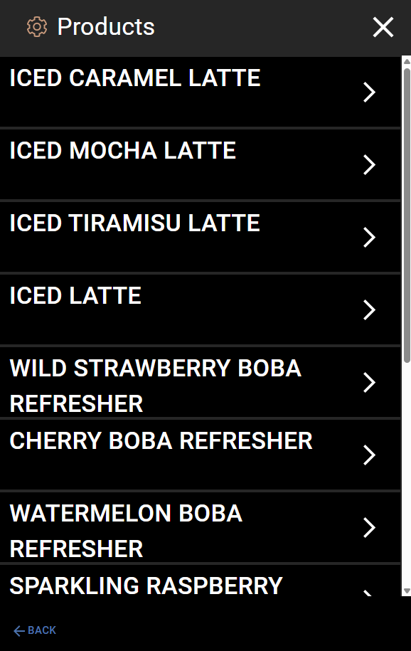
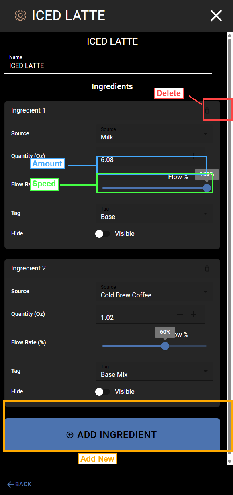

# Change Ingredient Amounts

This page shows you how to change how much of each ingredient goes into a recipe.

## How to Open a Recipe

1. Tap the **menu icon** (three lines) in the top-left corner of the home screen.

   

2. Tap **Settings**.

   

3. Tap **Products**. You will see a list of all recipes.

   

4. Tap the recipe you want to change. The Recipe Editor will open.

   

## Change the Amount of an Ingredient

Each ingredient card shows the current amount in ounces next to **Quantity (Oz)** (marked in blue in the screenshot above).

To change the amount:

1. Find the ingredient you want to change (for example, "Milk" or "Cold Brew Coffee").
2. Look at the **Quantity (Oz)** field. It shows the current amount.
3. Tap the **+** button to add more, or tap the **-** button to use less.
4. The number will update as you tap.

**Example:** In the screenshot above, Ingredient 1 (Milk) is set to **6.08 oz** and Ingredient 2 (Cold Brew Coffee) is set to **1.02 oz**.

## Change the Flow Rate

The **Flow Rate (%)** slider (marked in green in the screenshot) controls how fast the ingredient comes out of the machine. A higher number means faster flow.

To change the flow rate:

1. Find the ingredient you want to change.
2. Look at the **Flow Rate (%)** slider.
3. Drag the slider left to slow it down, or right to speed it up.
4. The percentage number on the right side will update as you drag.

**Example:** In the screenshot, Milk is set to **100%** flow rate and Cold Brew Coffee is set to **60%**.

> **Tip:** Only change the flow rate if a drink is pouring too fast or too slow. If you are not sure, leave it at the current setting.

## Understanding Tags

Each ingredient also has a **Tag** setting. The Tag controls when the ingredient pours during the drink. The machine pours in stages, with a brief pause between each stage.

| Tag | When It Pours | Use It For |
|-----|--------------|------------|
| **Base** | Stage 1 (first) | The main liquid (milk, water, soda water) |
| **Base Mix** | Stage 1 (first) | What mixes with the base (coffee, soda syrup) |
| **None** | Stage 1 (first) | Extra flavors in the first pour (vanilla, caramel) |
| **Stage 2** | Stage 2 (after a pause) | Toppings or layers (cream topper) |
| **Stage 3** | Stage 3 (last) | Anything added at the very end |

> **Tip:** You usually do not need to change the Tag unless you are moving an ingredient to a different stage or adding a new ingredient. See [Add an Ingredient](add-ingredient.md) for more detail on picking the right Tag.

## Hide / Visible Toggle

Each ingredient has a **Hide** toggle. When set to **Visible**, the ingredient shows up in the ingredient list on the Drink Build screen (the screen the customer sees when pouring a drink). When set to **Hidden**, the ingredient still pours, but the customer does not see it listed.

This is useful for ingredients you do not want to show the customer, like water or a base ingredient.

## When You Are Done

Tap the **X** in the top-right corner to close the recipe editor and go back to the Products list. Tap **BACK** at the bottom-left to go back to Settings.

Your changes are saved when you close the editor.
