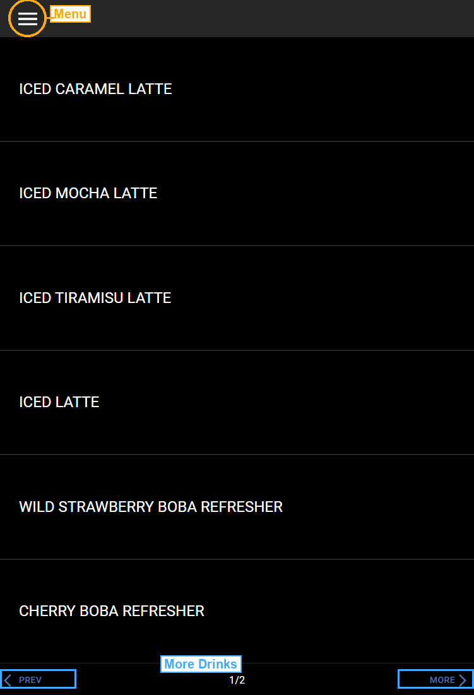
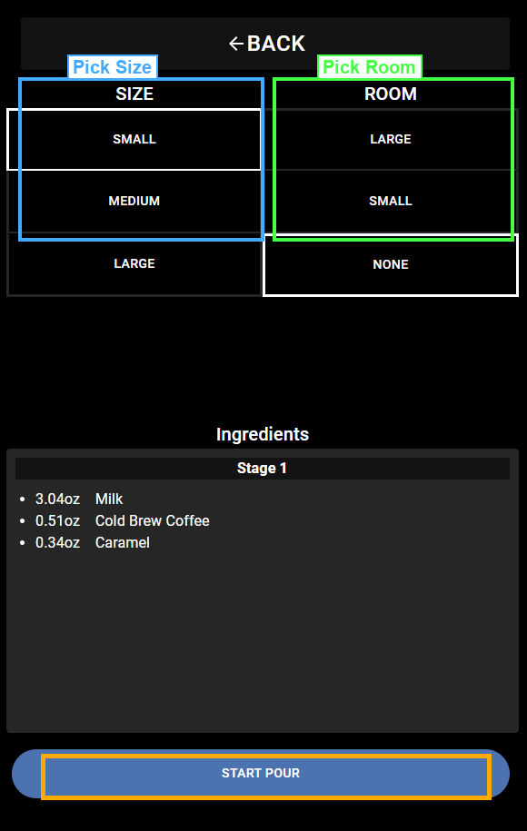
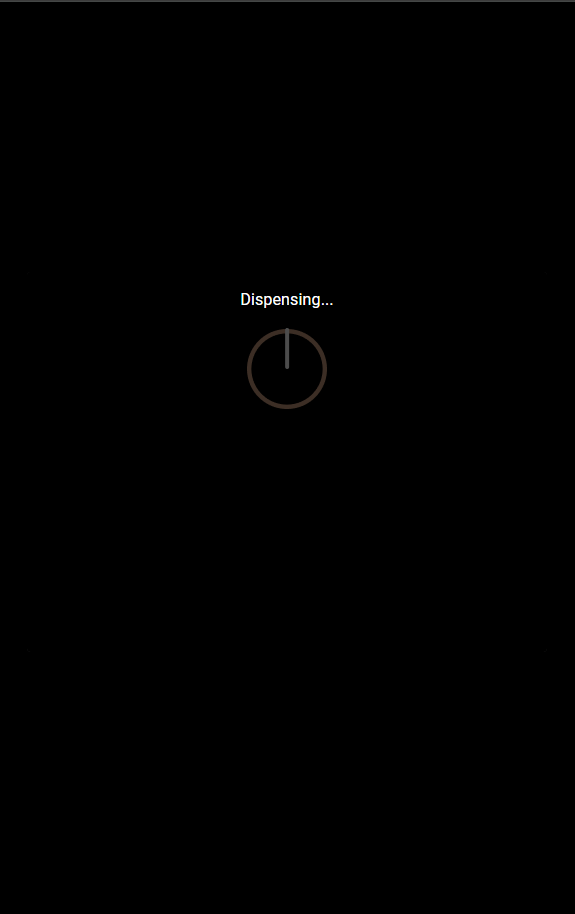

# How to Pour a Drink

This page shows you how to select a drink, pick a size, and pour it.

## Step 1: Pick a Drink

The home screen shows a list of drinks. Tap the drink you want to pour.

If you do not see the drink you want, tap **MORE** at the bottom-right to see more drinks (marked in blue). Tap **PREV** to go back.

## Step 2: Choose Your Size and Room

After you tap a drink, the Drink Build screen opens. You will see two columns: **SIZE** (marked in blue) and **ROOM** (marked in green).

### Size

Pick how much drink to pour:

- **Small** - smallest cup
- **Medium** - medium cup
- **Large** - largest cup

Tap the size you want. A white border shows which size is selected.

### Room

Room means how much space to leave in the cup. This is useful when you want to add something else later, like cream.

- **Large** - leaves a lot of space in the cup
- **Small** - leaves a little space in the cup
- **None** - fills the cup all the way

### Ingredients

Below the size and room options, you will see a list of **Ingredients**. This shows what is in the drink and how much of each ingredient (in ounces). The amounts change based on the size you pick.

## Step 3: Start the Pour

When you are ready, tap the **START POUR** button at the bottom of the screen.

The screen will show "Dispensing..." with a spinning icon while the drink is being poured. Wait for it to finish.

## Step 4: Remove Your Drink

When the screen goes back to the Drink Build screen, your drink is done. Remove the cup from under the tap.

## Going Back

To go back to the drink list at any time, tap the **BACK** button at the top of the Drink Build screen.
