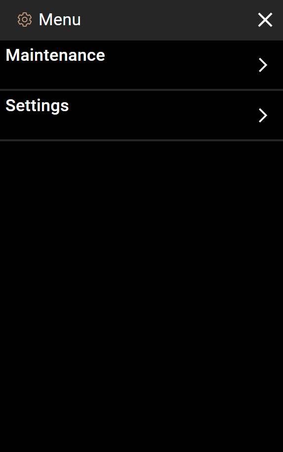
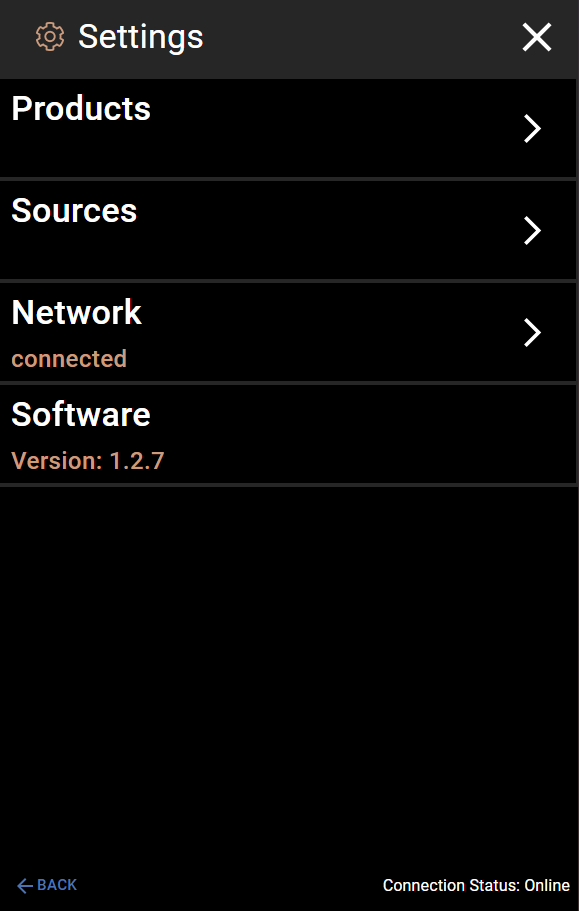

# How to Clean the Machine

This page shows you how to clean the machine. Cleaning should be done every **7 days**. The machine will show a warning **12 hours** before cleaning is due.

> **Important:** Cleaning is done by hand right now. Follow each step carefully.

## What You Will Need

- Approved cleaning solution / sanitizer
- A container to catch liquid from the tap
- About **15-20 minutes** of time

## Step 1: Set Up the Cleaner

Before you start on the touchscreen, prepare the machine hardware:

1. Install the cleaning solution into the machine, **or** move the cleaning lever to the cleaning position.
2. Make sure the cleaner is connected and ready to flow through the lines.

## Step 2: Open the Sources Screen

1. Tap the **menu icon** (three lines) in the top-left corner of the home screen.

   

2. Tap **Settings**.

   

3. Tap **Sources**. You will see a list of all the ingredient sources.

   

## Step 3: Flush Each Source with Cleaner

You need to run cleaner through every source, one at a time.

1. Tap the first source in the list (for example, "Caramel").

   

2. Place a container under the tap to catch the liquid.

3. Tap the **DISPENSE PRODUCT** button (marked in orange in the screenshot above). The machine will push cleaner through that line.

4. Wait until cleaner comes out of the tap, then stop the dispense.

5. Tap **BACK** to go back to the Sources list.

6. **Repeat steps 1-5 for every source in the list.** Do not skip any.

## Step 4: Wait 5 Minutes

After you have run cleaner through all the sources:

**Let the machine sit for 5 minutes.** This gives the sanitizer time to work and clean the inside of the lines.

> **Do not skip this step.** The sanitizer needs time to kill germs and bacteria.

## Step 5: Purge the Cleaner

Now you need to flush out all the cleaner and get product flowing again.

1. Switch the machine back to product. Remove the cleaner and reconnect the product, **or** move the cleaning lever back to the normal position.

2. Go back to **Settings** > **Sources**.

3. Tap the first source in the list.

4. Place a container under the tap.

5. Tap **DISPENSE PRODUCT**. At first, cleaner will come out. Keep dispensing until you see the **actual product** coming out of the tap.

6. Once product is flowing, stop the dispense.

7. Tap **BACK** and repeat for every source in the list.

## Step 6: Done

Once all sources are flowing product again, cleaning is complete. The machine is ready to use.

## Quick Reference

| Step | What to Do |
|------|------------|
| 1 | Install cleaner or move cleaning lever |
| 2 | Open Menu > Settings > Sources |
| 3 | Dispense from each source until cleaner flows |
| 4 | **Wait 5 minutes** for sanitizer to work |
| 5 | Switch back to product |
| 6 | Dispense from each source until product flows |
