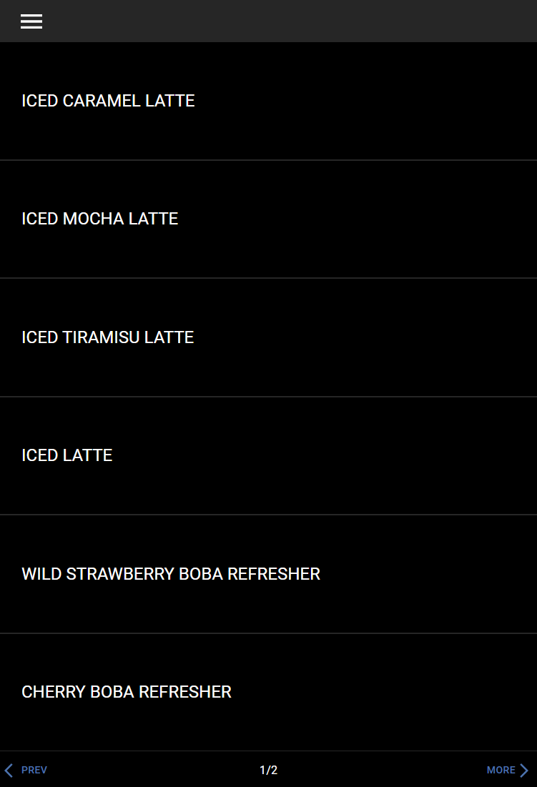

# YUM Machine Guide

Welcome to the YUM machine guide. This guide will show you how to use the machine touchscreen to make drinks, change recipes, and keep the machine clean.

## What's in This Guide

1. [How to Pour a Drink](basic-operation.md) - Select a drink, pick a size, and start pouring
2. [Change Ingredient Amounts](adjust-volume.md) - Make a recipe stronger, weaker, or change how much of each ingredient is used
3. [Add an Ingredient to a Recipe](add-ingredient.md) - Put a new ingredient into an existing recipe
4. [Remove an Ingredient from a Recipe](remove-ingredient.md) - Take an ingredient out of a recipe
5. [How to Clean the Machine](cleaning.md) - Step-by-step cleaning instructions
6. [Settings and Calibration](settings-and-calibration.md) - Sources, calibration, and other settings

## Screen Overview

The machine has a touchscreen. Here are the main screens you will use:

### Home Screen (Product Select)

This is the first screen you see. It shows all the drinks you can pour.

### Menu

Tap the **menu icon** (three lines) in the top-left corner to open the menu. From here you can get to **Maintenance** and **Settings**.

### Settings

The Settings screen lets you manage **Products** (recipes), **Sources** (ingredients), **Network**, and **Software** version.

