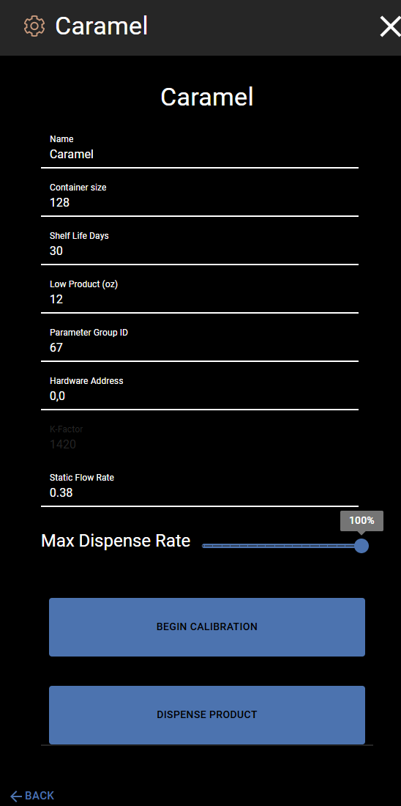
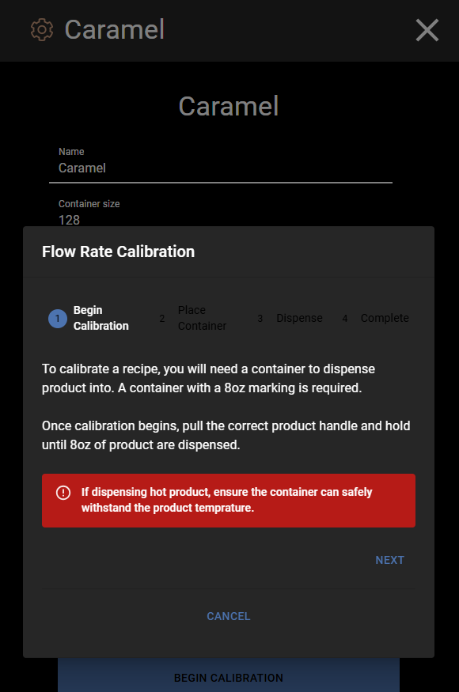
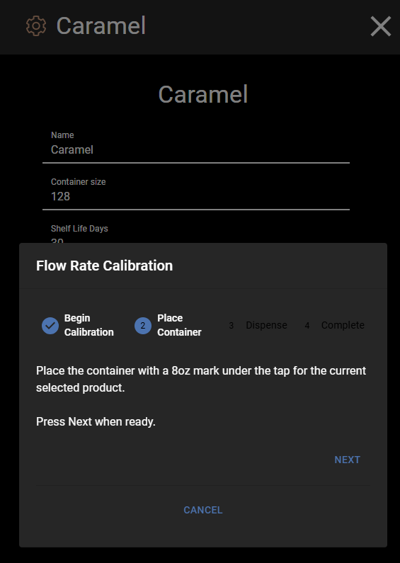
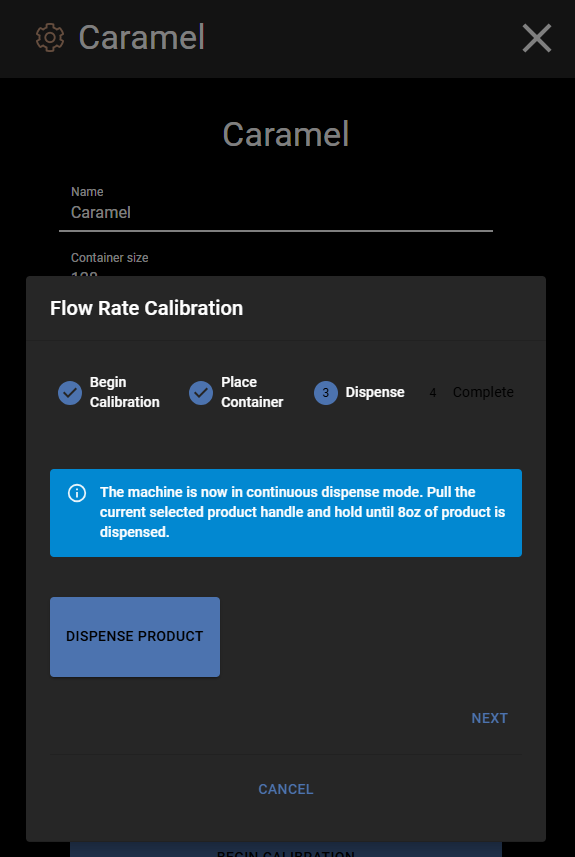
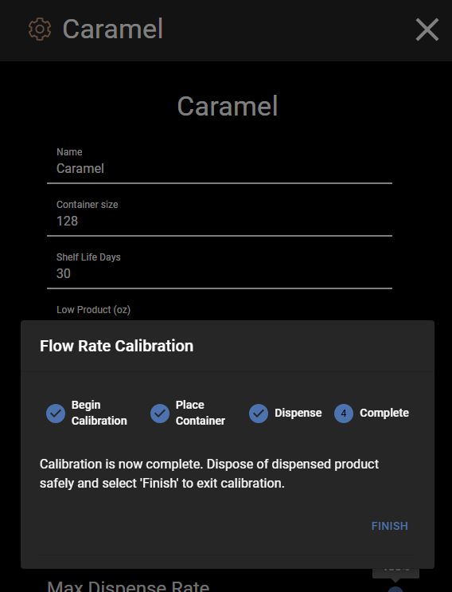

# Settings and Calibration

This page covers the Settings menu and how to calibrate a source.

## The Settings Menu

To open Settings:

1. Tap the **menu icon** (three lines) in the top-left corner.
2. Tap **Settings**.

The Settings screen has four sections:

| Section | What It Does |
|---------|-------------|
| **Products** | View and edit all drink recipes |
| **Sources** | View and edit all ingredient sources |
| **Network** | Shows if the machine is connected to the internet |
| **Software** | Shows the current software version |

## Products

Tap **Products** to see all the drink recipes on the machine.

Tap any recipe to open it and change its ingredients. See [Change Ingredient Amounts](adjust-volume.md) for details.

## Sources

Tap **Sources** to see all the ingredient sources on the machine.

Tap any source to see its details.

Each source shows:

| Field | What It Means |
|-------|--------------|
| **Name** | The name of the ingredient |
| **Container Size** | How many ounces are in a full container |
| **Shelf Life Days** | How many days the product stays fresh |
| **Low Product (oz)** | The machine warns you when this much product is left |
| **Max Dispense Rate** | How fast the ingredient pours (slider, 0-100%) |

There are also two buttons at the bottom:

- **BEGIN CALIBRATION** - Starts the calibration process (see below)
- **DISPENSE PRODUCT** - Pours this ingredient from the tap (used for cleaning and testing)

---

## Calibration

> **Warning:** Calibration is an advanced feature. It is **not** part of regular day-to-day use. Only use calibration if a drink is pouring the wrong amount, or if you have been told to calibrate by your support team.

Calibration helps the machine measure how fast an ingredient flows. This makes sure the right amount comes out when you pour a drink.

### What You Will Need

- A container with an **8 oz marking** on it
- The container must be safe for the product being dispensed

### How to Calibrate

1. Open **Settings** > **Sources** and tap the source you want to calibrate.

2. Tap the **BEGIN CALIBRATION** button at the bottom of the screen.

3. **Step 1 - Begin Calibration:** Read the instructions on screen. You will need a container with an 8 oz mark. Tap **NEXT** when ready.

   

4. **Step 2 - Place Container:** Put the container with the 8 oz mark under the tap for this ingredient. Tap **NEXT** when the container is in place.

   

5. **Step 3 - Dispense:** Tap **DISPENSE PRODUCT**. Pull the product handle and hold it until 8 oz of product has been dispensed into the container. Tap **NEXT** when done.

   

6. **Step 4 - Complete:** Calibration is done. Throw away the dispensed product safely. Tap **FINISH** to close.

   

### Canceling Calibration

You can tap **CANCEL** at any step to stop calibration and go back to the Source Editor.
