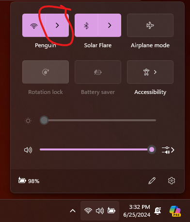
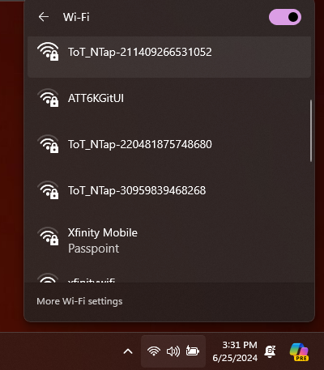
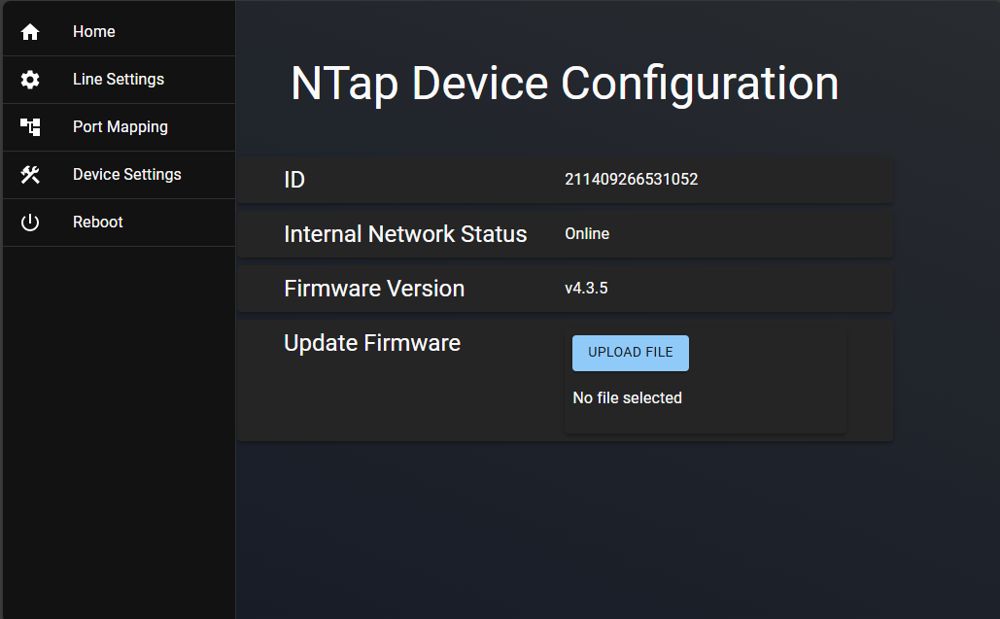
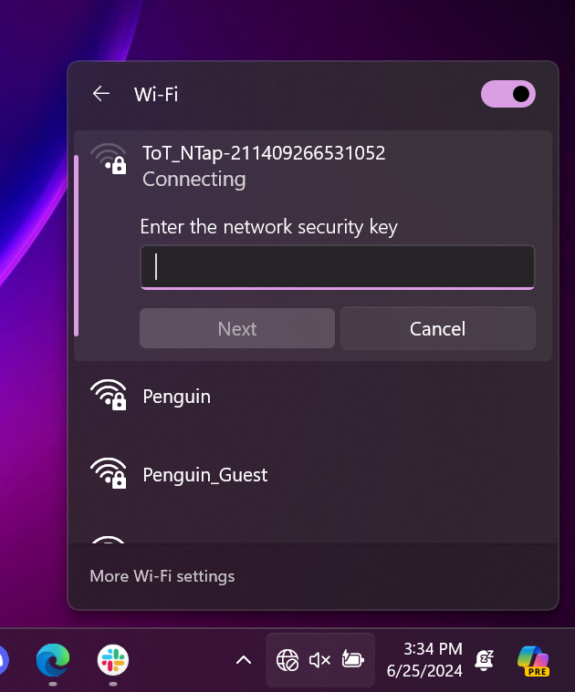

# Firmware Interface Connection

Each board has a user interface that can be accessed by Wi-Fi.

## Connecting to interface
Connecting to the interface is down through the windows Wi-Fi connection tool.

You can access this by clicking the Wi-Fi icon form a PC or tablet. This can be
found on the lower right of the task bar:
1. Click the Wi-Fi icon

1. Click the Wi-Fi icon, then select the arrow. You will then see a list of networks
appear. You may need to wait for a minute as Windows populates the list. If the
environment has many wireless devices or devices that may interfere with
wireless signal, then it may be necessary to attach an external antenna to the
NTap device.

1. Click the NTap device interface. The correct interface can be identified by the
GUID number after "ToT_NTap-"

1. Enter the device password eSi0dg23!

1. Click connect. After a short delay, a browser window should open with the
NTap interface. shown below:
