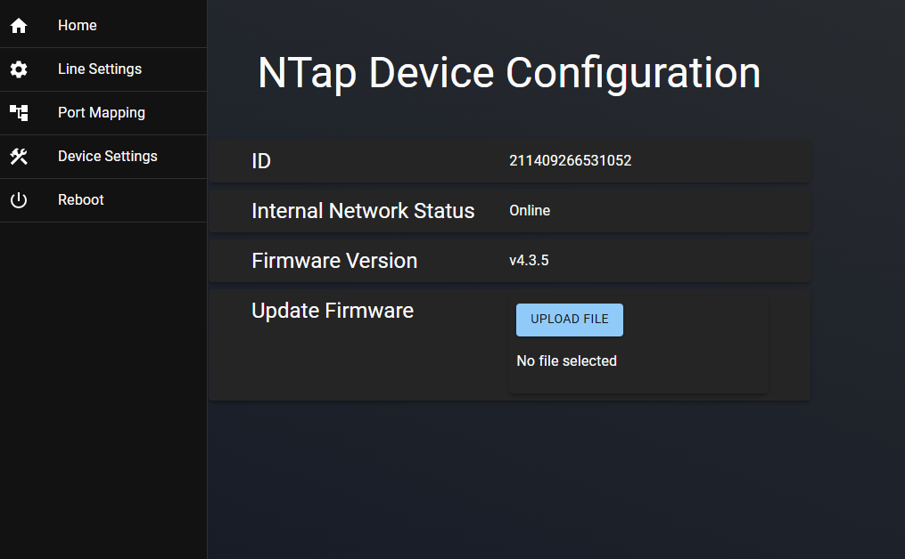
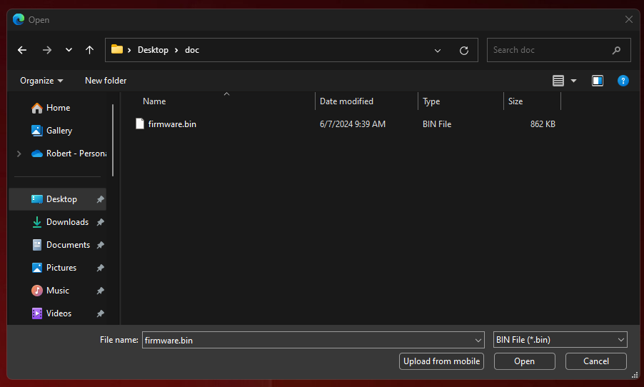
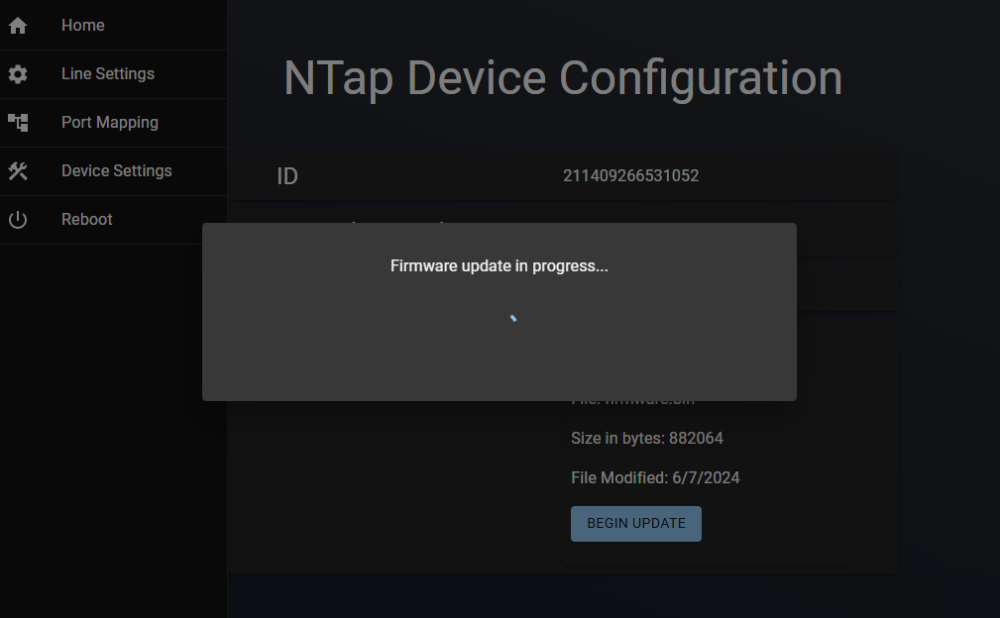

# Update Firmware

Firmware updates can be accomplished with the firmware interface. First, a windows device will
need to be connected to the NTap control board.
1. Once connected, click the Update Firmware button.

2. You will be presented with an explorer file selection dialog. Select the firmware file and click open.

3. Confirm the selection. Optionally cancel the update if an incorrect file was selected. Once
confirmed, click Begin Update. This will cause the board to go offline shortly after the update.

4. You will see a status spinner. Once the dialog disappears, the board will restart automatically.

The firmware process is now complete. You will be redirected back to the main screen where you
can verify the firmware version. Once finished, you can simply close the browser window and
disconnect the windows device from the Wi-Fi interface on the N-Tap unit